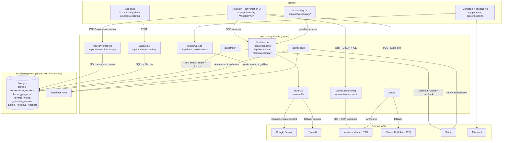

# Fina Web

> The web version of Fina — AI voice conversation practice for language learners, built on the myinterview Next.js codebase with every interview-only feature replaced or removed.

## Overview

Fina Web lets learners hold a live spoken conversation with an AI tutor in the language they're learning, instead of only drilling vocabulary lists. A visitor completes a short onboarding flow (tutor → language → level → motivation → daily goal → 30-day plan preview), signs up, and lands in an authenticated app: roleplay-driven voice conversations, AI-generated vocabulary lessons with flashcards, a 30-day study plan, streaks, and a Fina Pro subscription.

It targets the same Supabase project and user base as the Fina mobile app (Expo/React Native, `~/Desktop/fina`), reusing its `profiles`, `lesson_progress`, `favorite_words`, `generated_lessons`, `custom_roleplays`, and `feedback` tables and adding one web-only table (`conversation_sessions`) plus a handful of new `profiles` columns via an additive migration.

Status: built and verified in this repo — `npx tsc --noEmit` clean, `npm run build` succeeds, Jest and Playwright pass (see [Testing](#testing)).

## Features

Each item below is wired to a route or module in this repo:

- **Realtime voice conversation** (`app/app/conversation/`, `components/practice/VoiceCallView.tsx`) — WebRTC session against Inworld Realtime (server-brokered ICE/SDP), with a Web Speech recognition + SSE fallback when realtime is disabled or unsupported.
- **Roleplay scenarios** (`app/app/roleplay/`) — predefined scenarios from `lib/data/roleplays.ts` plus user-authored custom roleplays persisted to Supabase (`components/roleplay/*`).
- **Post-session analysis** (`app/api/ai/feedback/route.ts`, `components/conversation/AnalysisResults.tsx`) — six 0–100 scores (overall, fluency, grammar, vocabulary, engagement, relevancy), a short summary, up to 3 strengths, and up to 5 corrections, from the existing Gemini → OpenAI `streamLLM` path.
- **AI vocabulary generation** (`app/app/vocabulary/generate/`, `app/api/ai/vocabulary/route.ts`) — 12-word lessons from a topic, gated by the free/Pro allowance, saved to `generated_lessons`.
- **Flashcards and review** (`app/app/vocabulary/lessons/[lessonId]/`, `app/app/vocabulary/favorites/`, `components/vocabulary/*`) — word, IPA, part of speech, definition, example, pronunciation playback, favoriting, and a flip-card review mode.
- **Static lesson library** (`lib/data/lessons/`) — bundled lessons for Arabic, Chinese, English, French, German, Japanese, Portuguese, Russian, and Spanish.
- **Onboarding** (`app/onboarding/`) — tutor → language → level → motivation → daily goal → plan preview → AI consent, stored in `localStorage` (`lib/onboarding-storage.ts`) and synced to the profile after sign-up via `POST /api/profile/onboarding`.
- **30-day study plan** (`app/app/study-plan/`, `lib/study-plan.ts`, `lib/study-plan-storage.ts`) — by-week layout, today highlight, per-section (speak/words) local ticks, completed days on the profile.
- **Streaks** (`lib/streak.ts`, `components/home/StreakCard.tsx`, `components/conversation/StreakWeek.tsx`) — server-computed daily streak and weekly-activity dots, updated on conversation completion.
- **Pronunciation playback** (`lib/hooks/usePronunciation.ts`, `/api/tts`) — Inworld TTS per language/voice, falling back to `speechSynthesis`; audio cached in memory only (no Storage bucket writes from web).
- **Fina Pro subscription** (`app/api/stripe/*`, `lib/billing.ts`, `lib/stripe.ts`) — Stripe Checkout subscription (monthly $9.99 / yearly $59.99) with inline `price_data` (no dashboard price IDs needed), billing portal, and webhook-driven Pro status.
- **Accounts** — Google OAuth and email/password via Supabase Auth (`app/(auth)/*`, `app/auth/callback/`).
- **Feedback and account deletion** (`components/FeedbackProvider.tsx`, `app/api/account/route.ts`) — in-app feedback form; account deletion cancels an active Stripe subscription, deletes the user's rows, then deletes the auth user.

## Tech Stack

| Layer | Technology | Notes |
|---|---|---|
| Framework | Next.js 16.1.6 (App Router) | React 19.2.3, RSC-first |
| Language | TypeScript 5 | `strict: true`, `@/*` path alias to repo root |
| Styling | Tailwind CSS v4 + shadcn/ui (`new-york`) | PostCSS via `@tailwindcss/postcss`; Radix primitives (`radix-ui`); `lucide-react` icons; Fraunces (display, `font-display`) + Manrope (UI, `font-sans`) via `next/font/google` |
| Client state | TanStack Query v5 | Keys centralised in `lib/queries/keys.ts`; `sonner` for toasts; `next-themes` |
| Database + Auth | Supabase (Postgres, Auth) | `@supabase/ssr` cookie sessions; browser client for RLS-scoped reads/writes, service-role admin client for privileged server writes |
| Conversation LLM | Google Gemini 2.5 Flash Lite → OpenAI `gpt-5.4-mini` fallback | SSE streaming through `lib/llm.ts` |
| Realtime voice | Inworld Realtime (WebRTC) | Server brokers ICE servers and the SDP exchange (`app/api/realtime/*`); model `google-ai-studio/gemini-3.1-flash-lite-preview` |
| TTS | Inworld TTS 1.5 Mini → Chutes Kokoro → Web `SpeechSynthesis` | Three-tier fallback in `app/api/tts/route.ts` and `lib/hooks/useSpeechSynthesis.ts` |
| STT | Web Speech Recognition API | `lib/hooks/useSpeechRecognition.ts`, locale per target language; best supported in Chrome/Edge |
| Payments | Stripe (`stripe` v20) | Checkout `mode: "subscription"`, billing portal, webhook |
| Analytics | Mixpanel (EU host), Vercel Analytics | `lib/mixpanel.ts`, `components/MixpanelInit.tsx` |
| Testing | Jest 30 + Testing Library, Playwright | `next/jest`, `testEnvironment: "node"` by default, jsdom opt-in per file |
| Tooling | ESLint 9 (`eslint-config-next`), npm | Lockfile is `package-lock.json` |

## Architecture

A single Next.js App Router deployment serves the marketing site, pre-signup onboarding, the authenticated `/app` shell, and every API route. There is no separate backend service. Route handlers are the only place secrets live — the browser never talks to Gemini, OpenAI, Inworld, or Stripe directly, and the WebRTC handshake is proxied so `INWORLD_API_KEY` stays server-side. Persistence and identity are entirely Supabase; middleware refreshes the auth cookie on nearly every request and `app/app/layout.tsx` gates the authenticated shell.

The conversation feature has two execution modes chosen at runtime in `VoiceCallView`. When `NEXT_PUBLIC_INWORLD_REALTIME_ENABLED` is `"true"` and the browser has `RTCPeerConnection`, audio flows over a peer connection to Inworld and transcripts arrive on a data channel (`lib/hooks/useInworldRealtime.ts`). Otherwise the component falls back to Web Speech recognition plus SSE token streaming from `/api/ai/voice` and server-synthesised audio from `/api/tts`. Both modes converge on the same transcript shape, so scoring (`/api/ai/feedback`) is mode-agnostic.



### Project Structure

```
fina-web/
├── app/
│   ├── (auth)/                 # login, signup, forgot-password (shared auth layout)
│   ├── api/
│   │   ├── account/            # DELETE — cancel subscription, delete rows + auth user
│   │   ├── ai/                 # voice (conversation turns + hints), feedback, translate, vocabulary
│   │   ├── conversations/      # create/complete/list sessions, usage
│   │   ├── profile/            # GET/PATCH profile, POST onboarding upsert
│   │   ├── realtime/           # Inworld ICE-server config + SDP exchange proxy
│   │   ├── stripe/             # checkout, webhook, verify-purchase, portal
│   │   └── tts/                # Inworld → Chutes TTS proxy
│   ├── app/                    # authenticated shell: home, roleplay, conversation,
│   │                           #   vocabulary, study-plan, progress, settings
│   ├── auth/callback/          # OAuth/PKCE code exchange
│   ├── onboarding/             # pre-signup onboarding flow + completion handoff
│   └── layout.tsx, page.tsx    # root metadata + marketing landing page
├── components/
│   ├── practice/                # VoiceCallView (session engine), VideoArea, ControlBar, TranscriptPanel, ...
│   ├── landing/                  # marketing page sections (hero, pricing, FAQ, tutor trio, ...)
│   ├── onboarding/, roleplay/, vocabulary/, conversation/, home/
│   ├── structured-data/          # JSON-LD schema components
│   └── ui/                       # shadcn/ui primitives
├── lib/
│   ├── data/                     # lessons/* (9 languages), roleplays.ts, studyPlan.ts, onboarding.ts
│   ├── db/                       # profile, conversations, lessons, favorites, generatedLessons, customRoleplays, feedback
│   ├── hooks/                    # useInworldRealtime, useSpeechRecognition, useSpeechSynthesis, usePronunciation, useTimer
│   ├── queries/                  # TanStack Query hooks + key registry
│   ├── supabase/                 # browser / server / admin / middleware clients
│   ├── types/                    # profile, conversation, roleplay, vocabulary shapes
│   ├── utils/                    # buildConversationInstructions (realtime + hint + analysis prompts)
│   ├── billing.ts                # plans, free limits, hasProAccess
│   ├── languages.ts, levels.ts, tutors.ts   # domain registries
│   ├── llm.ts                    # Gemini → OpenAI streaming with fallback
│   ├── streak.ts                 # pure streak-update algorithm
│   └── onboarding-storage.ts, study-plan-storage.ts   # SSR-safe localStorage helpers
├── supabase/migrations/           # 20260913000000_fina_web.sql (additive, run manually)
├── middleware.ts                  # Supabase session refresh
├── e2e/                            # Playwright specs + hermetic Supabase stub
└── next.config.ts                 # security headers, cache policy, image config
```

### Data Flow

One AI conversation practice session, end to end:

1. **Usage check** — `app/app/conversation/ConversationClient.tsx` calls `GET /api/conversations/usage`, returning `{ isPro, freeLimit, freeUsed, freeRemaining }`.
2. **Start** — the user picks a roleplay and tutor (`app/app/roleplay/`). `POST /api/conversations` checks `hasProAccess()` against `FREE_CONVERSATIONS` (3), inserts a `conversation_sessions` row, and returns `403 { error: "limit_reached" }` when the free allowance is used up, which opens `ProUpgradeDialog`.
3. **Conversation** — `VoiceCallView` builds the system prompt with `buildConversationInstructions({ language, level, tutorName, roleplay })` and connects either:
   - _Realtime:_ `useInworldRealtime` fetches ICE servers from `/api/realtime/config`, creates an SDP offer, POSTs it to `/api/realtime/connect`, and applies the answer; transcripts arrive on the data channel, tutor audio on the remote track.
   - _Fallback:_ `useSpeechRecognition` transcribes locally in the target-language locale, each turn POSTs to `/api/ai/voice`, which streams Gemini (falling back to OpenAI) tokens back as SSE, and `/api/tts` returns Inworld or Kokoro audio, with `speechSynthesis` as the last resort.
4. **End** — the transcript goes to `POST /api/ai/feedback` for the six-score analysis; the client then calls `PATCH /api/conversations` with the analysis and the browser's local date/day-of-week, which persists the session, recomputes the streak with `computeStreakUpdate()`, and writes it back to `profiles`.
5. **Results** — `components/conversation/AnalysisResults.tsx` renders the scores, summary, strengths, corrections, and the updated streak week.

Onboarding: `localStorage` key `fina_onboarding` (`lib/onboarding-storage.ts`) → sign-up → `/auth/callback?next=/onboarding/complete` → `POST /api/profile/onboarding` (maps onboarding level ids to DB `UserLevel` values) → `/app`. `app/app/layout.tsx` redirects a signed-in user with no `target_language` back to `/onboarding`.

### Key Design Decisions

- **Server-brokered WebRTC, kept from myinterview.** The browser never sees `INWORLD_API_KEY`; only the prompt, persona, and language inputs changed for Fina.
- **Two conversation engines behind one component**, so a bad Inworld deploy degrades to browser speech + SSE instead of breaking practice.
- **Free limits instead of a device trial.** Mobile enforces a 24h device-local trial that cannot be enforced on web; web instead gives 3 free conversations and 3 free AI word generations, tracked server-side on `profiles`/counts, with Pro as unlimited.
- **Service-role usage minimised.** Only the Stripe webhook, the Stripe verify-purchase redirect, and account deletion construct the admin client, and they do so lazily inside the handler so a missing key never crashes module load — everything else goes through the RLS-scoped browser/SSR client.
- **Webhook re-retrieves subscription state** rather than trusting the event payload, since Stripe does not guarantee delivery order; this makes an out-of-order webhook a no-op instead of a Pro downgrade.
- **RevenueCat is not read on web.** Mobile Pro entitlements (RevenueCat) and web Pro status (Stripe → `profiles.pro_status`) are two independent systems — see [Known Limitations](#known-limitations).

### Data Model

Existing Fina tables (shared with the mobile app; schemas live in the Supabase project, not in this repo, except where noted):

| Table | Key fields | Purpose |
|---|---|---|
| `profiles` | `id` (→ `auth.users`), `email`, `display_name`, `user_level`, `target_language`, `learning_motivation`, `daily_goal_minutes`, `current_streak`, `last_conversation_date`, `weekly_activity`, `words_learned`, `accuracy`, `study_plan_start_date`, `study_plan_completed_days`, plus the web-only columns below | One row per user: onboarding results, streaks, 30-day plan progress, billing |
| `lesson_progress` | `user_id`, `lesson_id`, `completed_words`, `current_word_index`, `time_spent`, `accuracy`, `is_completed` | Per-lesson progress and completion, unique on `(user_id, lesson_id)` |
| `favorite_words` | `user_id`, `word_id`, `word_data` | Saved vocabulary for the favorites/review flow |
| `generated_lessons` | `user_id`, `topic`, `difficulty`, `lesson_data`, `is_global` | AI-generated vocabulary lessons (paginated + searchable) |
| `custom_roleplays` | `user_id`, `title`, `category`, `difficulty`, `user_role`, `ai_role`, `scenario` | User-authored roleplay scenarios |
| `feedback` | `user_id` (nullable), `type`, `message` | In-app feedback |

New in `supabase/migrations/20260913000000_fina_web.sql` — **additive and idempotent; must be applied manually in the Supabase SQL editor** (this repo does not run it):

- `profiles` gains: `native_language`, `tutor_id`, `ai_consent_at`, `stripe_customer_id`, `stripe_subscription_id`, `pro_status`, `pro_current_period_end` (plus an index on `stripe_subscription_id`).
- New table `conversation_sessions` — `id`, `user_id`, `roleplay_id`, `roleplay_title`, `tutor_id`, `language`, `level`, `status` (`active`/`completed`), `started_at`, `completed_at`, `duration_seconds`, `overall_score`, `analysis` (jsonb), `message_count`, with RLS policies scoping select/insert/update to `auth.uid() = user_id`.

### External Integrations

| Service | Used for | Called from |
|---|---|---|
| Supabase Auth | Google OAuth, email/password | `lib/supabase/{client,server,middleware}.ts`, `app/auth/callback/` |
| Supabase Postgres | All persistence (shared with the mobile app) | `lib/db/*`, most API routes |
| Google Gemini | Conversation turns, hints, feedback, translation, vocabulary generation | `lib/llm.ts` (server) |
| OpenAI | LLM fallback when Gemini throws | `lib/llm.ts` (server) |
| Inworld Realtime | WebRTC voice session | `app/api/realtime/*` (server) |
| Inworld TTS / Chutes Kokoro | Pronunciation + tutor voice audio | `app/api/tts` (server) |
| Stripe | Fina Pro subscription: Checkout, billing portal, webhook | `app/api/stripe/*` (server) |
| Mixpanel | Product analytics (EU residency host) | `lib/mixpanel.ts` (client) |
| Vercel Analytics | Web analytics | `app/layout.tsx` (client) |

## Getting Started

### Prerequisites

- Node.js 20+ and npm (lockfile is `package-lock.json`).
- Accounts/keys: the Fina Supabase project, Google AI Studio (Gemini), OpenAI, Inworld, Stripe (test keys are enough for local work).

### Installation

```bash
npm install
cp .env.example .env.local   # then fill in the values
```

### Environment Variables

See `.env.example` for the authoritative, commented list. Summary:

| Variable | Required | Purpose |
|---|---|---|
| `NEXT_PUBLIC_SUPABASE_URL` | yes | Fina Supabase project URL |
| `NEXT_PUBLIC_SUPABASE_ANON_KEY` | yes | Fina Supabase anon key |
| `SUPABASE_SERVICE_ROLE_KEY` | yes for billing + deletion | Stripe webhook, verify-purchase, and auth-user deletion |
| `GOOGLE_GEMINI_API_KEY` | yes | Primary LLM for conversation turns, hints, feedback, translation, vocabulary |
| `OPENAI_API_KEY` | yes | LLM fallback when the Gemini stream throws |
| `INWORLD_API_KEY` | yes | Realtime ICE servers, SDP exchange, and TTS synthesis |
| `INWORLD_VOICE_ID` | no | Default TTS voice when no language/tutor voice is supplied |
| `NEXT_PUBLIC_INWORLD_REALTIME_ENABLED` | no | `"true"` enables WebRTC realtime voice; otherwise Web Speech fallback |
| `CHUTES_API_KEY` | no | Kokoro TTS fallback when Inworld fails |
| `STRIPE_SECRET_KEY` | for payments | Checkout, billing portal, webhook, verify-purchase, subscription cancel on delete |
| `STRIPE_WEBHOOK_SECRET` | for payments | Verifies `/api/stripe/webhook` signatures |
| `NEXT_PUBLIC_APP_URL` | no | Absolute origin for Stripe URLs and `metadataBase`; falls back to the request origin |
| `NEXT_PUBLIC_MIXPANEL_TOKEN` | no | Enables Mixpanel; analytics is a no-op when unset |

Apply `supabase/migrations/20260913000000_fina_web.sql` by hand in the Supabase SQL editor before running the app against a fresh project state — see [Known Limitations](#known-limitations).

### Running Locally

```bash
npm run dev     # http://localhost:3000
npm run build   # production build
npm start        # serve the production build
npm run lint      # eslint
npx tsc --noEmit  # type check
```

Voice practice needs microphone permission and an HTTPS or `localhost` origin. Realtime mode additionally needs a browser with `RTCPeerConnection` and `NEXT_PUBLIC_INWORLD_REALTIME_ENABLED=true`; without it the app uses Web Speech recognition, which works best in Chrome/Edge.

## Testing

```bash
npm test               # jest, all unit/route suites
npm run test:watch     # watch mode
npm run test:coverage  # jest --coverage, enforced against jest.config.js thresholds
npm run test:ci        # jest --ci --coverage --runInBand

npm run e2e             # playwright, both projects (chromium + mobile)
npm run e2e:ui           # playwright UI mode
npm run e2e:headed       # headed chromium only
npm run e2e:report       # open the last HTML report
```

Jest runs through `next/jest` with `testEnvironment: "node"` by default (route handlers); browser-facing modules (hooks, react-query, analytics) opt in to `jsdom` per file with a `/** @jest-environment jsdom */` docblock. Route tests mock `@/lib/supabase/server` via `test-utils/supabase-mock.ts`. Coverage is collected from `lib/**`, `app/api/**`, and `middleware.ts`, and is a ratchet (`jest.config.js` `coverageThreshold`) — set just below measured coverage so a regression fails the run without needing to be raised on every unrelated change.

Playwright (`e2e/`) is hermetic: `e2e/support/global-setup.ts` and `e2e/stub/supabase.mjs` boot a local Supabase Auth stub alongside the real Next.js app on a dedicated port, so specs need no secrets and touch no production data or paid APIs — every AI/voice/TTS route is mocked at the browser layer (`e2e/support/test.ts`). Specs in `e2e/specs/` cover landing → onboarding → signup redirect, home rendering and navigation, roleplay → conversation start/end/results, vocabulary lessons/flashcards/favorites, and settings/billing entry points, across the `chromium` and `mobile` (Pixel 7 viewport) projects.

## Deployment

Deploys to Vercel from this repo.

1. Set every variable from `.env.example` in the Vercel project's Environment Variables (Production and Preview as needed).
2. Apply `supabase/migrations/20260913000000_fina_web.sql` in the Supabase SQL editor against the target project — it is not run automatically by any build step.
3. In Stripe, add a webhook endpoint pointing at `https://<your-domain>/api/stripe/webhook` subscribed to:
   - `checkout.session.completed`
   - `customer.subscription.created`
   - `customer.subscription.updated`
   - `customer.subscription.deleted`

   Copy the endpoint's signing secret into `STRIPE_WEBHOOK_SECRET`.
4. `npm run build` / Vercel's default Next.js build both work unmodified — there is no custom build step.

## Known Limitations

- **RevenueCat entitlements aren't shared with web.** Mobile Pro status lives in RevenueCat; web Pro status lives in Stripe → `profiles.pro_status`. A user who subscribes on one platform does not automatically get Pro on the other.
- **The migration must be applied manually.** `supabase/migrations/20260913000000_fina_web.sql` is not run by the Supabase CLI or any build/deploy step in this repo — apply it by hand in the Supabase SQL editor (mobile repo convention).
- **`SUPABASE_SERVICE_ROLE_KEY` is required** for the Stripe webhook (`/api/stripe/webhook`), the Stripe verify-purchase redirect (`/api/stripe/verify-purchase`), and deleting the `auth.users` row on account deletion (`/api/account`). Without it, the webhook responds `500` and account deletion still removes the user's table rows but leaves the auth user behind.
- **Web Speech recognition works best in Chrome/Edge.** The non-realtime conversation fallback (`lib/hooks/useSpeechRecognition.ts`) depends on the browser's `SpeechRecognition` implementation, which Safari and Firefox support inconsistently or not at all.
- **Account deletion cancels an active Stripe subscription first.** `DELETE /api/account` calls `stripe.subscriptions.cancel()` for a profile with `pro_status` in `active`/`trialing`/`past_due` before deleting any rows; if the Stripe cancel call fails, the whole deletion aborts with a `502` rather than deleting an account with live billing attached.
- **Pronunciation audio is not cached in Storage on web.** Unlike mobile (which writes to the `pronunciation-audio` bucket), `/api/tts` responses are cached in memory only per session, so repeated plays across sessions re-synthesise.
- **AI routes require an authenticated Supabase user.** There is no anonymous trial on web (unlike myinterview's cookie-based trial) — every `/api/ai/*` and `/api/conversations` call returns `401` for a signed-out request.
