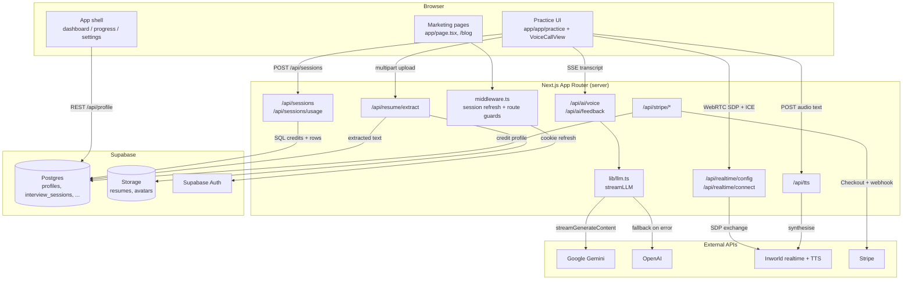

# MyInterview

> AI-powered mock interview practice — a voice interviewer that runs behavioural, technical, and case interviews, then scores the transcript.

## Overview

MyInterview is a Next.js web app for candidates preparing for job interviews. A user picks an interview type and an AI interviewer persona, optionally uploads a resume or pastes a job description, and then holds a live spoken interview with an LLM-driven interviewer. When the session ends, a second LLM pass scores the transcript and returns structured feedback (verdict, 0–10 score, per-category breakdown, per-question review).

The app runs anonymous-first: three free sessions are gated by an HTTP-only cookie with no account required, and those sessions are claimed onto the user's profile when they eventually sign up. Beyond the trial, practice is paid via one-time Stripe session-credit packs.

Status: production, actively developed. Version is `0.1.0`, there is no CI pipeline in the repo, and two test suites currently fail (see [Testing](#testing)). The marketing site is live at `myinterview.com` (hardcoded in `app/layout.tsx` and `app/sitemap.ts`).

## Features

- **Live voice interviews** — WebRTC realtime session against Inworld, or a browser-speech fallback path (`components/practice/VoiceCallView.tsx`).
- **Three interviewer personas** — Henry (case), Luna (behavioural), Jake (technical), each with an avatar, idle/speaking video loops, and its own TTS voice (`lib/interviewers.ts`).
- **Resume-aware prompting** — PDF/DOCX upload, server-side text extraction, injected into the interviewer system prompt (`app/api/resume/extract/route.ts`).
- **Job-description tailoring** — a pasted JD is folded into both the interview prompt and the scoring prompt.
- **Structured post-session feedback** — strict-JSON LLM grading with verdict, score, categories, strengths, improvements, tips, and per-question review (`app/api/ai/feedback/route.ts`).
- **Anonymous 3-session trial** — cookie-scoped, later claimed into the account on signup (`lib/anon-session.ts`, `app/api/auth/claim/route.ts`).
- **Stripe session-credit packs** — 5 / 20 / 50 session one-time purchases, credited idempotently via both webhook and success-redirect (`lib/session-limits.ts`).
- **Progress tracking** — session history, streaks, and competency scores surfaced on the dashboard and progress pages.
- **Peer practice** — session creation, join requests, and notifications exist as routes and pages, but the sidebar entry is commented out in `app/app/AppSidebar.tsx`, so it is not reachable from the app nav.
- **Content marketing** — 13 blog posts compiled into the bundle from `lib/blog.ts`, statically generated at `/blog/[slug]`, plus `robots.ts`, `sitemap.ts`, and JSON-LD structured data.
- **Admin console** — password-cookie-gated `/admin` for waitlist and job-application review.

## Tech Stack

| Layer            | Technology                                                                     | Notes                                                                                                                |
| ---------------- | ------------------------------------------------------------------------------ | -------------------------------------------------------------------------------------------------------------------- |
| Framework        | Next.js 16.1.6 (App Router)                                                    | React 19.2.3, RSC-first, `serverExternalPackages` for `pdf-parse`/`pdfjs-dist`                                       |
| Language         | TypeScript 5                                                                   | `strict: true`, `@/*` path alias to repo root                                                                        |
| Styling          | Tailwind CSS v4 + shadcn/ui (`new-york`)                                       | PostCSS via `@tailwindcss/postcss`; Radix primitives; `lucide-react` icons; Sora font                                |
| Client state     | TanStack Query v5                                                              | Keys centralised in `lib/queries/keys.ts`; `sonner` for toasts; `next-themes`                                        |
| Database + Auth  | Supabase (Postgres, Auth, Storage)                                             | `@supabase/ssr` cookie sessions; anon client for RLS-scoped reads, service-role client for privileged writes         |
| Interview LLM    | Google Gemini 2.5 Flash Lite → OpenAI fallback                                 | SSE streaming through `lib/llm.ts`; Chutes AI helper present but not wired into the fallback chain                   |
| Realtime voice   | Inworld Realtime (WebRTC)                                                      | Server brokers ICE servers and the SDP exchange; model requested is `google-ai-studio/gemini-3.1-flash-lite-preview` |
| TTS              | Inworld TTS 1.5 Mini → Chutes Kokoro → Web SpeechSynthesis                     | Three-tier fallback across `app/api/tts/route.ts` and `lib/hooks/useSpeechSynthesis.ts`                              |
| Payments         | Stripe (`stripe` v20, API `2026-02-25.clover`)                                 | One-time Checkout, no subscriptions in the active path                                                               |
| Document parsing | `pdf-parse`, `mammoth`                                                         | Dynamically imported inside the route handler                                                                        |
| Analytics        | Mixpanel (EU host), Vercel Analytics, Google Analytics, Google Ads conversions | `lib/mixpanel.ts`, `lib/conversion.ts`                                                                               |
| Testing          | Jest 30 + Testing Library                                                      | `next/jest`, `testEnvironment: node`                                                                                 |
| Tooling          | ESLint 9 (`eslint-config-next`), npm                                           | Lockfile is `package-lock.json`                                                                                      |

`@anthropic-ai/sdk` is listed as a dependency but is not imported anywhere in `app/`, `lib/`, or `components/`.

## Architecture

A single Next.js App Router deployment does everything: it serves the marketing site, the authenticated app shell, and every API route. There is no separate backend service. Route handlers are the only place secrets live — the browser never talks to Gemini, OpenAI, Inworld, or Stripe directly, and even the WebRTC handshake is proxied so the Inworld key stays server-side. Persistence and identity are entirely Supabase; middleware refreshes the auth cookie on nearly every request and enforces the `/app` and `/admin` gates.

The interview itself has two execution modes chosen at runtime in `VoiceCallView`. When `NEXT_PUBLIC_INWORLD_REALTIME_ENABLED` is `"true"` and the browser has `RTCPeerConnection`, audio flows over a peer connection to Inworld and transcripts arrive on a data channel. Otherwise the component falls back to Web Speech recognition in the browser plus SSE token streaming from `/api/ai/voice` and server-synthesised audio from `/api/tts`. Both modes converge on the same transcript shape, so scoring is mode-agnostic.

Access control is deliberately split. Authenticated users spend `session_credits` on the `profiles` row; anonymous users are identified only by the `mi_anon_id` cookie, and their session rows are counted with the service-role client because RLS would otherwise hide them.



### Project Structure

```
myinterview/
├── app/
│   ├── (auth)/                 # login, signup, forgot-password (shared auth layout)
│   ├── admin/                  # password-cookie-gated waitlist + applications console
│   ├── api/
│   │   ├── admin/              # waitlist + job-application CRUD, admin login/logout
│   │   ├── ai/                 # chat (unused), voice (interview turns), feedback (scoring)
│   │   ├── auth/claim/         # attach anonymous sessions to a new account
│   │   ├── peer-sessions/      # peer practice create/list/join/respond
│   │   ├── realtime/           # Inworld ICE-server config + SDP exchange proxy
│   │   ├── resume/extract/     # PDF/DOCX → text
│   │   ├── sessions/           # session create/complete + remaining-usage check
│   │   ├── stripe/             # checkout, webhook, verify-purchase, portal
│   │   └── tts/                # Inworld → Chutes TTS proxy
│   ├── app/                    # authenticated shell: dashboard, practice, progress, resources, settings
│   ├── auth/callback/          # OAuth/PKCE code exchange + anonymous-session claim
│   ├── blog/                   # statically generated posts from lib/blog.ts
│   └── layout.tsx, page.tsx    # root metadata + marketing landing page
├── components/
│   ├── practice/               # VoiceCallView (session engine), VideoArea, ControlBar, TranscriptPanel, ...
│   ├── sections/               # landing page sections (hero, pricing, FAQ, video, ...)
│   ├── structured-data/        # JSON-LD schema components
│   └── ui/                     # shadcn/ui primitives
├── lib/
│   ├── hooks/                  # useInworldRealtime, useSpeechRecognition, useSpeechSynthesis, useAudioVisualizer, useTimer
│   ├── queries/                # TanStack Query hooks + key registry
│   ├── supabase/               # browser / server / admin / middleware clients
│   ├── types/                  # UserProfile shape, Web Speech ambient types
│   ├── utils/                  # buildInterviewInstructions (realtime system prompt)
│   ├── anon-session.ts         # mi_anon_id cookie helpers, MAX_ANON_SESSIONS
│   ├── blog.ts                 # 13 blog posts as inline data
│   ├── interviewers.ts         # persona registry
│   ├── llm.ts                  # Gemini → OpenAI streaming with fallback
│   ├── practice-data.ts        # competency categories, question bank, experience levels
│   └── session-limits.ts       # pack pricing + free-trial constant
├── docs/superpowers/           # design specs and implementation plans
├── middleware.ts               # Supabase session refresh + /app and /admin guards
└── next.config.ts              # security headers, cache policy, image config
```

`_bmad/`, `_bmad-output/`, `design-artifacts/`, `strategy.md`, and `ideas.md` are planning and analysis artifacts, not application code.

### Data Flow

One AI practice session, end to end:

1. **Usage check** — `app/app/practice/page.tsx` calls `GET /api/sessions/usage`. For an authenticated user it reads `profiles.session_credits`; for a visitor it mints/reads the `mi_anon_id` cookie and counts existing `interview_sessions` rows with the service-role client, returning `MAX_ANON_SESSIONS - used`.
2. **Setup** — the user picks interview type (which selects the matching persona), experience level, target role, and optionally pastes a JD or uploads a resume. A resume upload posts to `/api/resume/extract`, which parses PDF via `pdf-parse` or DOCX via `mammoth` and returns text held in component state.
3. **Session create** — `POST /api/sessions` inserts an `interview_sessions` row with `topic` encoded as `"<category>|<question>"`. The authenticated branch decrements `session_credits` and increments `practice_sessions_used` in the same request; the anonymous branch writes `anonymous_id` instead of `user_id`. Out of credits returns `403 { error: "limit_reached" }`, which opens the upgrade modal.
4. **Interview** — `VoiceCallView` acquires media and branches:
   - _Realtime:_ `buildInterviewInstructions()` composes the persona prompt from type, level, question, role, JD, and resume. `useInworldRealtime` fetches ICE servers from `/api/realtime/config`, creates an offer, POSTs the SDP to `/api/realtime/connect`, and applies the answer. Session config, user turns, and completed transcripts move over the data channel; agent audio arrives as a remote media stream.
   - _Fallback:_ `useSpeechRecognition` transcribes locally, each turn POSTs to `/api/ai/voice`, `streamLLM()` streams Gemini tokens (falling back to OpenAI on any throw) back as SSE, and `/api/tts` returns Inworld or Kokoro audio — with Web SpeechSynthesis as the last resort if TTS answers `503`.
5. **Scoring** — on end, the transcript plus level, role, JD, and resume go to `POST /api/ai/feedback`, which prompts for strict JSON (verdict, score, categories, strengths, improvements, tips, per-question review) and returns it to the results view.
6. **Completion** — `PATCH /api/sessions` marks the row complete and records duration/score, which is what the dashboard, progress page, and streak counters read back.
7. **Claim on signup** — after the visitor signs up, `app/auth/callback/route.ts` (with `POST /api/auth/claim` as an idempotent retry) reassigns rows matching the `mi_anon_id` cookie to the new `user_id`, bumps `practice_sessions_used`, and deletes the cookie.

### Key Design Decisions

- **Server-brokered WebRTC** — the browser never sees `INWORLD_API_KEY`; `/api/realtime/config` and `/api/realtime/connect` proxy ICE discovery and the SDP exchange. Trade-off: two extra round-trips before the call connects.
- **Two interview engines behind one component** — realtime is env-flagged, so a bad Inworld deploy degrades to browser speech plus SSE rather than breaking practice. Trade-off: `VoiceCallView` carries both code paths (~900 lines) and mic acquisition is deliberately skipped in realtime mode, because calling `getUserMedia({audio})` there makes the SDK's own call fail with `NotReadableError`.
- **Provider fallback in `streamLLM`** — Gemini is primary for cost, OpenAI catches any error. Trade-off: the `catch` is untyped, so a Gemini quota error and a malformed-response bug both silently switch providers.
- **Anonymous trial in a cookie, not an account** — removes the signup wall before first value. Trade-off: the limit is per-device and clearing cookies resets it, and every anonymous read needs the service-role client to bypass RLS.
- **Stripe credited twice, idempotently** — both the webhook and the success redirect can grant credits, guarded by `profiles.last_stripe_session_id`. Trade-off: duplicated crediting logic in two files, in exchange for credits appearing instantly even if the webhook is slow or misconfigured.
- **Blog posts as a TypeScript module** — `lib/blog.ts` holds all 13 posts inline, so `/blog/[slug]` statically generates with no CMS and no fetch. Trade-off: every edit is a deploy, and post content ships in the bundle graph.
- **Admin auth is a stateless signed cookie** — `lib/admin-auth.ts` issues an HMAC-SHA256 token (`base64url(payload).base64url(sig)`) carrying an expiry and a random nonce, signed with `ADMIN_SESSION_SECRET`. The password is never derivable from the cookie, and rotating the secret revokes every outstanding session. Built on Web Crypto rather than `node:crypto` so middleware (edge) and route handlers (Node) share one implementation. Trade-off: stateless means no per-session revocation — you revoke all sessions or none. That's proportionate for a single-operator console; a token table would be the next step if `/admin` gains multiple users.
- **`serverExternalPackages`** — `pdf-parse` and `pdfjs-dist` are excluded from bundling because bundling mangles the pdfjs worker path at runtime.

### Data Model

Supabase Postgres. Schema is managed in the Supabase dashboard — there are no migration files in the repo, so the columns below are the ones the code actually reads and writes.

| Table                                         | Purpose                                              | Key columns seen in code                                                                                                                                                                   |
| --------------------------------------------- | ---------------------------------------------------- | ------------------------------------------------------------------------------------------------------------------------------------------------------------------------------------------ |
| `profiles`                                    | One row per auth user; the billing and stats hub     | `id`, `full_name`, `avatar_url`, `resume_url`, `resume_text`, `experience_level`, `target_role`, `target_companies`, `session_credits`, `practice_sessions_used`, `last_stripe_session_id` |
| `interview_sessions`                          | One row per practice session, AI or peer             | `user_id`, `anonymous_id`, `type`, `topic`, `status`, duration/score fields                                                                                                                |
| `progress_scores`                             | Per-competency scoring history                       | competency, score, timestamp                                                                                                                                                               |
| `user_streaks`                                | Current and longest practice streaks                 | read by `/api/profile`                                                                                                                                                                     |
| `subscriptions`                               | Legacy plan records                                  | read by `/api/profile` and `lib/queries/subscription.ts`                                                                                                                                   |
| `peer_sessions` / `peer_session_participants` | Peer practice sessions and their joiners             | host, slot, status                                                                                                                                                                         |
| `notifications`                               | In-app notifications (peer join requests)            | read/PATCH via `/api/notifications`                                                                                                                                                        |
| `waitlist`                                    | Marketing waitlist captures                          | surfaced in `/admin`                                                                                                                                                                       |
| `job_applications`                            | Career-service applications with uploaded resume URL | surfaced in `/admin`                                                                                                                                                                       |
| `contact_messages`                            | Contact form submissions                             | written by `/api/contact`                                                                                                                                                                  |
| `user_feedback`                               | In-app rating + category + message                   | written from the practice results view                                                                                                                                                     |

Relationships: `profiles.id` is the auth user id and the foreign key every user-owned table hangs off. `interview_sessions` is the exception — it is keyed by `user_id` _or_ `anonymous_id`, and the claim flow migrates rows from the latter to the former.

Storage buckets: `resumes` (uploaded CVs) and `avatars` (profile images). Neither has a companion table — the public URL and, for resumes, the extracted `resume_text` are written straight onto `profiles`.

### External Integrations

| Service                       | Used for                                                           | Called from                                        |
| ----------------------------- | ------------------------------------------------------------------ | -------------------------------------------------- |
| Supabase                      | Postgres, Auth, Storage                                            | `lib/supabase/*`, every API route, `middleware.ts` |
| Google Gemini                 | Primary interview + feedback LLM                                   | `lib/llm.ts` (server)                              |
| OpenAI                        | LLM fallback when Gemini throws                                    | `lib/llm.ts` (server)                              |
| Inworld                       | Realtime WebRTC voice agent + TTS 1.5 Mini                         | `app/api/realtime/*`, `app/api/tts` (server)       |
| Chutes AI                     | Kokoro TTS fallback; a Qwen chat helper exists but is unreferenced | `app/api/tts`, `lib/llm.ts` (server)               |
| Stripe                        | One-time Checkout for session packs, webhooks, billing portal      | `app/api/stripe/*` (server)                        |
| Mixpanel                      | Product analytics + session recording, EU residency host           | `lib/mixpanel.ts` (client)                         |
| Vercel Analytics              | Web analytics                                                      | `app/layout.tsx` (client)                          |
| Google Analytics / Google Ads | Pageviews and conversion events                                    | `app/layout.tsx`, `lib/conversion.ts` (client)     |

## Getting Started

### Prerequisites

- Node.js — no `engines` field is declared; Next.js 16 and React 19 require Node 20+.
- npm (the repo is locked with `package-lock.json`).
- Accounts/keys: Supabase project, Google Gemini API key, OpenAI API key, Inworld API key, Stripe account (test keys are enough for local work).

### Installation

```bash
git clone https://github.com/nekruza/myinterview.git
cd myinterview
npm install
```

### Environment Variables

There is no `.env.example` in the repo. Create `.env.local` (or `.env`) with the following. Names and purposes below are taken from `process.env` references in the code; never commit real values.

| Variable                               | Required     | Purpose                                                                                        |
| -------------------------------------- | ------------ | ---------------------------------------------------------------------------------------------- |
| `NEXT_PUBLIC_SUPABASE_URL`             | yes          | Supabase project URL — used by browser, server, and service-role clients                       |
| `NEXT_PUBLIC_SUPABASE_ANON_KEY`        | yes          | Supabase anon key for RLS-scoped browser/server access                                         |
| `SUPABASE_SERVICE_ROLE_KEY`            | yes          | Privileged writes: anonymous session counting, session claiming, Stripe crediting              |
| `GOOGLE_GEMINI_API_KEY`                | yes          | Primary LLM for interview turns and feedback scoring                                           |
| `OPENAI_API_KEY`                       | yes          | LLM fallback when the Gemini stream throws                                                     |
| `INWORLD_API_KEY`                      | yes          | Realtime ICE servers, SDP exchange, and TTS synthesis                                          |
| `INWORLD_VOICE_ID`                     | no           | Default TTS voice when the persona does not supply one                                         |
| `NEXT_PUBLIC_INWORLD_REALTIME_ENABLED` | no           | Set to `"true"` to enable WebRTC realtime mode; anything else uses the browser-speech fallback |
| `CHUTES_API_KEY`                       | no           | Kokoro TTS fallback when Inworld fails                                                         |
| `STRIPE_SECRET_KEY`                    | for payments | Checkout session creation, purchase verification, billing portal                               |
| `STRIPE_WEBHOOK_SECRET`                | for payments | Verifies `checkout.session.completed` webhook signatures                                       |
| `NEXT_PUBLIC_APP_URL`                  | no           | Absolute origin for Stripe success/cancel URLs; falls back to the request origin               |
| `NEXT_PUBLIC_MIXPANEL_TOKEN`           | no           | Enables Mixpanel; analytics is a no-op when unset                                              |
| `ADMIN_PASSWORD`                       | for `/admin` | The admin console login password, checked with a timing-safe comparison                        |
| `ADMIN_SESSION_SECRET`                 | for `/admin` | Signing key for the admin session cookie; must be ≥32 chars. Rotating it logs out every admin  |

`SUPABASE_URL`, `SUPABASE_ANON_KEY`, `NEXT_PUBLIC_BASE_URL`, `NEXT_PUBLIC_LLM_PROVIDER`, `STRIPE_PRO_QUARTERLY_PRICE_ID`, and `FAL_KEY` also appear in the local `.env` but are not read anywhere in the current source — they are leftovers from earlier iterations.

### Running Locally

```bash
npm run dev     # http://localhost:3000
npm run build   # production build
npm start       # serve the production build
npm run lint    # eslint
```

Voice practice needs microphone permission and an HTTPS or `localhost` origin. Realtime mode additionally needs a browser with `RTCPeerConnection` and `NEXT_PUBLIC_INWORLD_REALTIME_ENABLED=true`; without it the app uses Web Speech recognition, which is Chromium-only in practice.

## Testing

```bash
npm test              # jest, all suites
npx jest --watch      # watch mode
```

Jest runs through `next/jest` with `testEnvironment: node` and the `@/*` alias mapped to the repo root.

Current state — 12 suites, 74 tests: **10 suites pass, 2 fail (70 passing, 4 failing).**

- `lib/__tests__/session-limits.test.ts` asserts `SESSION_LIMITS.starter/pro/max`, but `lib/session-limits.ts` now exports only `free` and `pro` under the legacy `SESSION_LIMITS` map. The test is stale relative to the pack-based pricing model.
- `app/api/realtime/connect/__tests__/route.test.ts` also fails. TODO: diagnose — not investigated during this documentation pass.

Covered: admin session tokens (signing, tampering, expiry, legacy-cookie rejection), the login rate limiter, pack pricing math, realtime route handlers, the realtime hook, `buildInterviewInstructions`, the waitlist route, and the TanStack Query hooks (profile, subscription, notifications, peer sessions).
